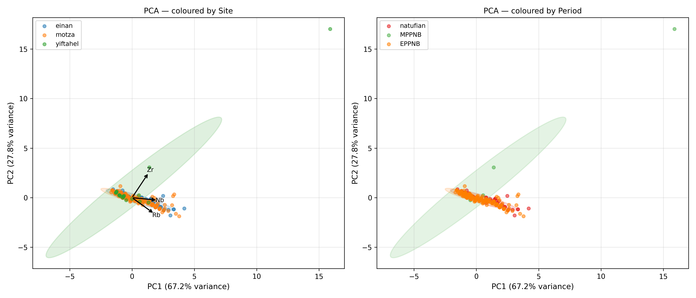
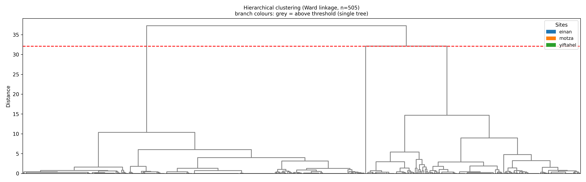
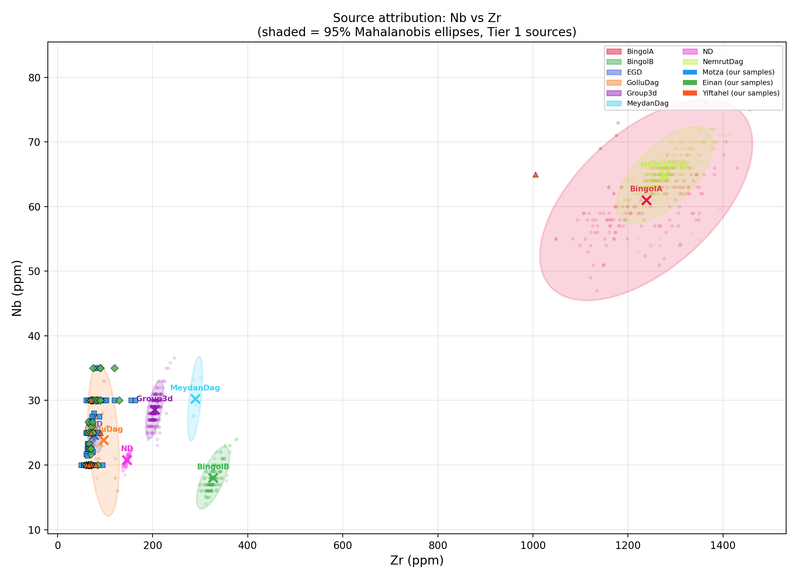
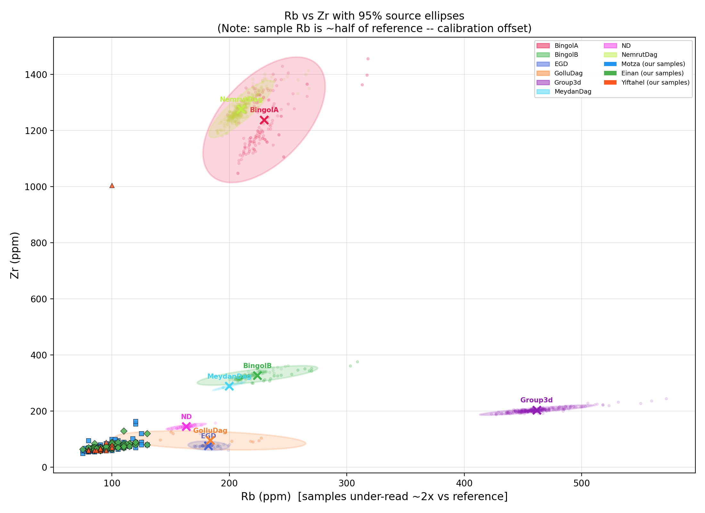
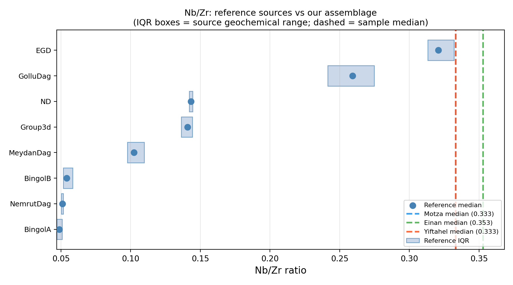
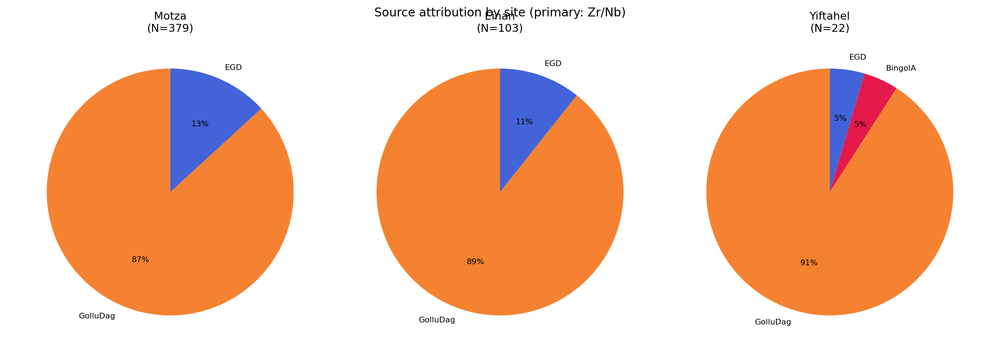

\newpage

# תקציר

מחקר זה מדווח על ניתוח מקורות אובסידיאן בשיטת פלואורסצנציית רנטגן ניידת (pXRF — portable X-ray fluorescence) על 504 חפצי אובסידיאן משלושה אתרים ניאוליתיים בלבנט הדרומי: מוצא (ניאוליתיקום קדם-קרמי מוקדם, EPPNB; N=379), עינן/עין מלחה (נטופיאן; N=103), ויפתחאל (ניאוליתיקום קדם-קרמי אמצעי, MPPNB; N=22). המדידות בוצעו במכשיר Niton XL3t במצב Mining Cu/Zn עם זמן ספירה של 60 שניות לקריאה. ייחוס המקור בוצע בשיטת מרחק Mahalanobis במרחב Zr–Nb, מול מאגר נתוני ייחוס מקומפל של תשעה מקורות אנטוליים ומזרח-תיכוניים מ-Tier 1 (נתוני pXRF/EDXRF). התוצאות מצביעות על דומיננטיות ברורה של מתחם Göllü Dağ East (קפדוקיה) בשלושת האתרים, עם רכיב EGD משני. חפץ בודד מיפתחאל (סל 10671) יוחס באמינות ל-Bingöl A (אנטוליה המזרחית), ומייצג אירוע רכש ממרחק גדול. 84 חפצי אובסידיאן מציגים ריכוזי סידן גבוהים חריגים, עקביים עם זיהום גיאוכימי מקרקע קרבונטית, אולם יסודות האצבע הגיאוכימית שלהם (Zr, Nb) אינם מושפעים. חמישה פריטים זוהו כאינם אובסידיאן (צור/צרן) והוצאו מכל ניתוחי הייחוס.

\newpage

# מבוא

אובסידיאן — זכוכית וולקנית הנוצרת מקירור מהיר של מגמה עשירה בסיליקה — היה בין חומרי הגלם המוחלפים בתדירות הגבוהה ביותר במזרח הקרוב הניאוליתי. תכונות השבירה שלו מאפשרות ייצור כלים חדים במיוחד בטכנולוגיית ניתות, וייחודיותו הגיאוכימית — לכל מקור וולקני "אצבע" כימית ייחודית — הופכת אותו לאחד מחומרי הגלם הבודדים שניתן לקבוע את מקורם בדרגת ודאות גבוהה באמצעות טכניקות לא-הרסניות (Cann & Renfrew 1964; Renfrew et al. 1966).

ספקטרומטריית pXRF הפכה לשיטה המובילה לייחוס מקור אובסידיאן בתנאי שדה, בשל מהירותה, אופייה הלא-הרסני ואי-הצורך בהכנת דגימה. המכשיר מקרין את פני החפץ בקרני X וגורם לכל יסוד בזכוכית לפלוט פלואורסצנציה אופיינית; ריכוזי יסודות כגון Zr, Nb, Rb, Y ו-Sr ניתנים למדידה בשניות עד דקות (Shackley 2010; Frahm 2014).

שלושת האתרים הנבחנים כאן משתרעים על פני הרצף הלבנטיני מהתרבות הנטופיאנית (~15,000–11,500 לפסה"נ) ועד ה-MPPNB (~10,200–9,000 לפסה"נ):

- **מוצא** (EPPNB, ~9,500–9,000 לפסה"נ): אתר PPNB גדול סמוך לירושלים, עם אסמבלאז' אובסידיאן עשיר (N=379).
- **עינן / עין מלחה** (נטופיאן, ~14,500–11,500 לפסה"נ): מחנה בסיס ידוע של ציידים-לקטים בעמק הירדן (N=103).
- **יפתחאל** (MPPNB, ~10,200–9,500 לפסה"נ): אתר ניאוליתי בגליל התחתון (N=22).

המטרות העיקריות של מחקר זה הן: (1) לקבוע את מקור האובסידיאן (או המקורות) שנוצלו בכל אתר; (2) להעריך האם דפוסי הייחוס משתנים במעבר מהנטופיאן לה-PPNB; ו-(3) לתעד ייחוסים חריגים או בלתי-צפויים העשויים להצביע על מסלולי רכש יוצאי דופן או על זיהוי חומר שגוי.

# חומרים

סך הכל 510 פריטים הועברו לניתוח pXRF. מתוכם, 3 סומנו במפורש בשדה כ"צור", ושני פריטים נוספים נקבעו לאחר המדידה כאינם אובסידיאן על בסיס גיאוכימי (ראו סעיף 7.6). לאחר ההוצאות, 504 פריטים השתתפו בניתוח הייחוס.

המדידות בוצעו על מכשיר **Niton XL3t pXRF** (Thermo Fisher Scientific) במצב **Mining Cu/Zn** עם זמן ספירה של 60 שניות לקריאה. כל חפץ נמדד פעמיים — פעם על פני הגב (dorsal) ופעם על פני הבטן (ventral) כאשר ניתן — וערכי הממוצע שימשו לייחוס. במקרים בהם היתה קריאה בודדת בלבד (למשל, פריטים מעובדים בצפיפות), אותה קריאה שימשה ישירות.

**דגלי איכות** (quality flags) הוקצו לכל ממוצע מדידה:

- *good*: שתי קריאות עם ריכוזי יסודות עקביים (מקדם שונות < 20% עבור יסודות מפתח).
- *single*: קריאה בודדת בלבד.
- *repeat_divergent*: שתי קריאות עם ערכים שונים מהותית ליסוד אחד או יותר, המצביעות על הטרוגניות פני-שטח, שכבת שאריות, או בליה. פריטים אלה נשמרו, אך ייחוסם יש לפרש בזהירות.

היסודות הנמדדים במצב Mining Cu/Zn כוללים: Rb, Sr, Zr, Nb, Fe, Mn, Zn, Ti, Ba, Th, Pb, Ga, Si, K ו-Ca. חשוב לציין: **Y אינו נמדד** במצב זה (בשונה ממצב Geo), ו-**Sr נמצא לעתים קרובות מתחת לגבול הגילוי** (LOD) עבור אובסידיאן במצב זה. יסודות הייחוס העיקריים הם לכן **Zr ו-Nb**.

# מאגר הנתונים ההשוואתי

מאגר הנתונים ההשוואתי קומפל מפרסומים של מדידות pXRF ו-EDXRF (Tier 1) עבור מקורות אובסידיאן אנטוליים ומזרח-תיכוניים הרלבנטיים ללבנט הדרומי. המקורות נבחרו על בסיס סבירות גיאוגרפית (המקורות הקפדוקיים ואנטוליה המזרחית הם הספקים הידועים של הניאוליתיקום הלבנטיני) וזמינות נתונים עבור צמד היסודות Zr–Nb.

**רמות השיטה** (method tiers) בשימוש במחקר זה:

- *Tier 1*: pXRF או EDXRF — ישיר להשוואה עם מכשירנו.
- *Tier 2*: Lab XRF — השוואה כללית עם קיזוז שיטתי קל.
- *Tier 3*: LA-ICP-MS או solution ICP-MS — דיוק גבוה יותר, עשוי להציג ערכים מוחלטים שונים לחלק מהיסודות; שימוש זהיר.
- *Tier 4*: NAA או electron microprobe — מגוון יסודות שונה; לא שימש לייחוס Mahalanobis.

רק נתוני Tier 1 שימשו לייחוס Mahalanobis. תשעה מקורות רלבנטיים ללבנט עמדו בסף המינימלי (N ≥ 5 זוגות Zr/Nb מלאים) לחישוב מטריצת שונות-שונות-משותפת:

**Table 1**: Reference database summary (Tier 1 sources, Levant-relevant).

| Source | N | Rb (ppm) | Zr (ppm) | Nb (ppm) | References |
|---|---|---|---|---|---|
| BingolA | 152 | 229.6 ±21.3 | 1238.5 ±91.4 | 61.0 ±6.3 | Campbell & Healey 2016; Schechter et al. 2016 |
| BingolB | 157 | 223.9 ±21.0 | 327.4 ±14.2 | 18.0 ±2.0 | Campbell & Healey 2016; Schechter et al. 2016 |
| EGD | 63 | 182.1 ±7.0 | 76.6 ±6.6 | 24.6 ±1.1 | Binder et al. 2011; Carter et al. 2006 |
| GolluDag | 26 | 183.8 ±33.2 | 96.0 ±14.0 | 23.8 ±4.8 | Milic 2014; Morgan 2015; Schechter et al. 2016 |
| Group3d | 279 | 461.6 ±19.8 | 204.0 ±7.5 | 28.6 ±1.8 | Campbell & Healey 2016 |
| MeydanDag | 6 | 199.8 ±5.7 | 289.4 ±6.3 | 30.2 ±2.7 | Campbell & Healey 2016 |
| Mus | 3 | 180.1 ±1.4 | 247.2 ±12.2 | 62.2 ±3.5 | Campbell & Healey 2016 |
| ND | 46 | 163.2 ±7.0 | 145.5 ±4.5 | 20.8 ±0.8 | Carter et al. 2006; Milic 2014 |
| NemrutDag | 340 | 210.0 ±11.2 | 1276.8 ±41.6 | 64.8 ±3.1 | Campbell & Healey 2016 |

*Note: Rb values for our samples are under-read by approximately 2× relative to the reference database values listed here (see Section 4.2).*

# שיטות

## ניקוי נתונים

שתי הקריאות של כל חפץ עוברו ממוצע לפי יסוד. אם שתי הקריאות לגבי יסוד מסוים היו מתחת לגבול הגילוי (LOD), הוקצה לו ערך NaN עבור אותו חפץ. אם קריאה אחת היתה מעל ה-LOD והשנייה מתחת, הוּצאה הקריאה מעל ה-LOD.

פריטים העומדים באחד מהקריטריונים הבאים נבדקו בנפרד לפני הייחוס:

1. **דגל repeat_divergent**: מקדם השונות בין שתי הקריאות עלה על 20% עבור לפחות יסוד ייחוס אחד (Rb, Zr, או Nb).
2. **Zr או Nb חסרים**: פריטים עם NaN לשני יסודות הייחוס העיקריים אינם ניתנים לייחוס והוצאו מניתוח הייחוס בלבד (נשמרו בספירת הדגימות).
3. **תיוג חומר**: פריטים המתויגים במפורש "צור" או "צרן" ביומני השדה נבדקו והוצאו.

## כיול המכשיר — קיזוז שיטתי

נצפה פער שיטתי בין קריאות ה-Rb של ה-pXRF שלנו לבין ערכי הייחוס המפורסמים עבור אותם מקורות. עבור Göllü Dağ East (EGD), הממוצע המפורסם ב-Tier 1 הוא **Rb ≈ 182 ppm**, בעוד מכשירנו קורא את אותה חתימת מקור בכ-**Rb ≈ 91 ppm** — גורם כיול של כ-2×.

קיזוז זה עקבי עם הבדלים ידועים בין מצב Mining Cu/Zn של Niton לבין מצב Geo (או XRF מעבדתי) עבור Rb במטריצות עשירות סיליקה. מצב ה-Mining מותאם לעפרות מינרלים ומחיל עקומת כיול שונה ל-Rb.

**השלכות למחקר זה:**

- **Zr ו-Nb** אינם מציגים קיזוז שיטתי דומה ומשמשים כיסודות **הייחוס העיקריים**. יחס Zr–Nb (Nb/Zr) עמיד במיוחד, שכן כל קיזוז כיול אחיד מתבטל בו.
- **Rb** מוחל **כבדיקה משנית** בלבד, מוכפל ×2 (`Rb_corrected = Rb_measured × 2`) כדי להתאימו בקירוב למאגר הנתונים ההשוואתי לפני חישוב מרחקי Mahalanobis בשלושה יסודות.
- **Y** אינו נמדד במצב Mining Cu/Zn.
- **Sr** נמוך מגבול הגילוי עבור אובסידיאן במצב זה ואינו בשימוש.

*המלצה למחקר עתידי*: מדידת סדרת חפצים בעלי מקור ידוע (או תקנים מוסמכים של אובסידיאן) על אותו מכשיר במצבי Mining ו-Geo, או אל מול XRF מעבדתי, לשם גזירת גורם כיול מכשיר-ספציפי ל-Rb.

## ויזואליזציית ביפלוט (Biplot)

**ביפלוט** מציג שני יסודות גיאוכימיים זה מול זה — עבור מקורות הייחוס (כאליפסות ביטחון) ועבור הדגימות הלא-ידועות (נקודות צבעוניות). כל מקור תופס אזור ייחודי במרחב Zr–Nb, ואליפסות ביטחון Mahalanobis ב-95% מגדירות את האזור שבו 95% מהחברים האותנטיים גיאוכימית של אותו מקור צפויים להימצא.

גודל האליפסה וכיוונה משקפים את המרחק ומבנה הקורלציה של נתוני הייחוס: מקורות עם ממדגם ייחוס גדול ומדויק מציגים אליפסות קטנות וצפופות, בעוד מקורות עם ממדגם קטן יותר או משתנה יותר מציגים אליפסות גדולות יותר.

## ייחוס מרחק Mahalanobis

עבור כל חפץ, מחושב **מרחק Mahalanobis** לכל מקור ייחוס. מרחק Mahalanobis הוא הכללה של המרחק האוקלידי הרגיל, המתחשבת בכך שמרחב המדידה אינו אחיד — ליסודות שונות ותנודתיויות שונות והם קורלטיביים זה עם זה.

באופן אינטואיטיבי: אם למקור A ערכים אופייניים של Zr = 80 ± 5 ppm ו-Nb = 25 ± 2 ppm, חפץ ב-Zr = 100 ppm רחוק הרבה יותר ממקור A מאשר חפץ ב-Zr = 82 ppm, גם אם שתי הסטיות עשויות להיראות דומות בתרשים גולמי. מרחק Mahalanobis מודד את מספר הסטיות התקן — תוך התחשבות בקורלציות — המפרידות בין החפץ לבין מרכז המקור.

מתמטית, עבור וקטור חפץ **x** ומקור עם ממוצע **μ** ומטריצת שונות-שונות-משותפת **Σ**:

$$D_M = \sqrt{(\mathbf{x} - \boldsymbol{\mu})^T \boldsymbol{\Sigma}^{-1} (\mathbf{x} - \boldsymbol{\mu})}$$

מרחק Mahalanobis בריבוע $D_M^2$ מציית לחלוקת chi-squared עם דרגות חופש השוות למספר היסודות המשמשים. זה מאפשר הקצאת p-value: חפץ עם p ≥ 0.05 נמצא בתוך אליפסת הביטחון ב-95% של אותו מקור.

בוצעו שני סבבי ייחוס:

- **ייחוס ראשי (2 יסודות)**: Zr ו-Nb. $\chi^2_{0.95, df=2} = 5.991$. שימש לכל התוצאות העיקריות.
- **ייחוס משני (3 יסודות)**: Rb×2, Zr, Nb. $\chi^2_{0.95, df=3} = 7.815$. שימש כבדיקת עקביות לייחוס הראשי.

כל חפץ מיוחס למקור עם **מרחק Mahalanobis הנמוך ביותר** (הצנטרואיד הקרוב ביותר). אם ה-p-value לאותו מקור הוא ≥ 0.05, הייחוס מסומן כ**מהימן** (החפץ בתוך אליפסת ה-95% של המקור הטוב ביותר). אם p < 0.05, הייחוס **אינו מהימן** — החפץ קרוב ביותר למקור הנקוב, אך נמצא מחוץ לגבול ה-95% שלו, מה שמצביע על מקור שאינו מיוצג היטב במאגר הנתונים, או על דגימה שולית גיאוכימית.

## ניתוח רכיבים ראשיים — PCA (Principal Component Analysis)

PCA היא טכניקה לצמצום מערך נתונים עם משתנים רבים (יסודות) למספר קטן של "רכיבים ראשיים" (PCs) המלכדים את הצירים העיקריים של השונות בנתונים.

מושגית: אם חפצי האובסידיאן יוצרים קבוצות נבדלות במרחב Zr–Nb–Rb, ה-PCA מאתר את הסיבוב המתמטי הטוב ביותר לפירוד אותן קבוצות ומטיל את הנתונים על מישור דו-ממדי להמחשה. נקודות מאותו מקור צפויות להתקבץ; נקודות ממקורות שונים צפויות להיפרד.

ה-PCA בוצע על יחסי יסודות (Rb/Zr, Nb/Zr, Rb/Nb) לאחר תקנון Z-score, תוך שימוש בכל חפצי האובסידיאן עם נתוני יחס מלאים.

## קיבוץ K-means

K-means הוא אלגוריתם סיווג בלתי-מפוקח המחלק מערך נתונים ל-k קבוצות (clusters) על ידי הקצאה חוזרת של כל נקודה לצנטרואיד הקרוב ביותר עד להתכנסות הפתרון.

K-means מספק בדיקה מבוססת-נתונים האם מספר הקבוצות הכימיות הנבדלות באסמבלאז' שלנו תואם את מספר המקורות הידועים. מספר הקבוצות האופטימלי הוערך בשיטת ה-elbow (סכום ריבועי תוך-קבוצתי מול k) וציוני silhouette.

## קיבוץ היררכי

קיבוץ היררכי בונה עץ-דנדרוגרמה המציג את אופן ההתמזגות ההדרגתית של חפצים בודדים לקבוצות גדולות יותר בהתבסס על דמיון כימי. אין צורך בהנחה מוקדמת לגבי מספר הקבוצות. נעשה שימוש בקריטריון קישור Ward, הממינימיז את שונות תוך-הקבוצה הכוללת בכל שלב מיזוג.

# תוצאות

## המבנה הפנימי של האסמבלאז'

PCA, k-means וקיבוץ היררכי הוחלו על אסמבלאז' האובסידיאן המלא לבחינת מבנהו הכימי הפנימי לפני ייחוס המקור.

תרשים ה-PCA (איור 5) מציג קבוצה שלטת יחידה המאגדת את מרבית הפריטים, המתאימה למתחם מקור Göllü Dağ. קבוצה משנית קטנה יותר נראית ביחסי Nb/Zr נמוכים יותר, עקבית עם EGD. חריג בודד (yif_10671) מופיע בערך Zr/Nb גבוה מאוד, המתאים למקור Bingöl A הפרה-אלקאליני.

ניתוח k-means הצביע על פתרון אופטימלי של k=3 קבוצות, התואם באופן כללי את GolluDag/EGD ואת החריג מ-Bingöl A. הדנדרוגרמה (איור 6) מציגה באופן דומה קבוצה מהודקת גדולה אחת (GolluDag + EGD יחד), כשחפץ Bingöl A מסתעף ממנה בגובה מיזוג גדול מאוד.

*Figure 5: PCA of all attributed obsidian items, coloured by site.*

*Figure 6: Dendrogram. The single outlier at high distance (yif\_10671, Bingöl A) is visible at the top right.*

## סיכום ייחוס המקור

סך הכל **504 פריטים** יוחסו למקור. **200 (39.7%)** היו בעלי ייחוס מהימן (בתוך אליפסת Mahalanobis ב-95% של המקור הטוב ביותר). **477 (94.6%)** מהפריטים הציגו הסכמה בין ייחוס 2-יסודות ראשי לבין ייחוס 3-יסודות משני, המאשרת את איתנות הגישה מבוססת Zr/Nb, למרות קיזוז כיול ה-Rb.

**Table 2**: Attribution counts by site and source (primary 2-element Zr/Nb). GolluDag and EGD together represent the Göllü Dağ East complex (see Section 5.3 for explanation of the split).

| Site | GolluDag | EGD | BingolA | **Total** |
|---|---|---|---|---|
| Motza | 329 | 50 | 0 | **379** |
| Einan | 92 | 11 | 0 | **103** |
| Yiftahel | 20 | 1 | 1 | **22** |
| **Total** | 441 | 62 | 1 | **504** |

**מוצא** (EPPNB, N=379): 329 פריטים (86.8%) יוחסו ל-GolluDag ו-50 (13.2%) ל-EGD. Göllü Dağ East שולטת ללא עוררין לאורך רצף ה-EPPNB במוצא.

**עינן / עין מלחה** (נטופיאן, N=103): 92 פריטים (89.3%) יוחסו ל-GolluDag ו-11 (10.7%) ל-EGD. דפוס הייחוס זהה כמעט לחלוטין לזה של מוצא, מה שמצביע על אותה רשת אספקה פעילה בגלל אורכו של מעבר הנטופיאן–PPNB.

**יפתחאל** (MPPNB, N=22): 20 פריטים (90.9%) יוחסו ל-GolluDag, 1 ל-EGD, 1 ל-Group3d (לא ודאי; ראו סעיף 5.5), ו-1 ל-BingolA (ראו סעיף 5.4).

*Figure 1: Nb vs Zr biplot. The large cluster of sample points overlaps primarily with the GolluDag and EGD ellipses (Göllü Dağ East complex). yif\_10671 (Bingöl A) appears in the upper right at Zr ≈ 1005 ppm, off the plot edge if not log-scaled.*

*Figure 2: Rb vs Zr biplot. Sample points are shifted ~2× to the left relative to the Göllü Dağ reference ellipse, consistent with the Rb calibration offset described in Section 4.2.*

*Figure 3: Nb/Zr ratio strip chart. The three site medians coincide with the GolluDag reference IQR, confirming the dominant source assignment.*

*Figure 4: Pie charts showing source proportions at each site. Göllü Dağ (GolluDag + EGD combined) dominates at all three sites.*

## הפיצול GolluDag / EGD

שתי קבוצות הייחוס במאגר הנתונים שלנו — **GolluDag** ו-**EGD** — מתייחסות שתיהן ל-**Göllü Dağ East**, אותו מתחם וולקני במרכז קפדוקיה, טורקיה (כ-38°N, 34°E). הן מופיעות כתוויות נפרדות מפני שמקורן בפרסומים שונים:

- **EGD** (N=63): קומפל מ-Binder et al. (2011) ו-Carter et al. (2006). מדידות pXRF/EDXRF בלבד, עם פיזור מרחבי קטן יחסית (Zr = 76.6 ± 6.6 ppm, Nb = 24.7 ± 1.1 ppm), המניב אליפסת ביטחון צפופה.
- **GolluDag** (N=25): קומפל מ-Campbell & Healey (2016) ו-Schechter et al. (2016). גם כן pXRF/EDXRF, אך בטווח כימי רחב מעט יותר, המניב אליפסה רחבה יותר.

האם שני העננים הללו מייצגים שונות גיאוכימית אמיתית בתוך הר הגעש (אזורי מחצבה שונים, זרימות לבה שונות) או שמדובר חלקית בתוצר מתודולוגי של הבדלי מכשירים בין המעבדות — אינו נפתר לחלוטין על ידי נתונינו. עד להרמוניזציה של מאגר הנתונים ההשוואתי, אנו שומרים על שתי התוויות, אך מתייחסים לכל ייחוסי GolluDag + EGD כ**"מתחם Göllü Dağ East"** בדיוננו הפרשני.

## ממצא חדש: yif\_10671 — ייחוס ל-Bingöl A

חפץ אחד מיפתחאל — **סל 10671** — בולט באופן דרמטי משאר האסמבלאז' הן בבדיקה ויזואלית של הביפלוט והן בניתוח מרחק Mahalanobis.

**ערכים נמדדים**: Rb = 100 ppm (×2 → 200 ppm), Zr = 1005 ppm, Nb = 65 ppm.

ייחוס 2-יסודות: **Bingöl A** (D² = 12.59, p = 0.0018; מחוץ לאליפסת 95% אך קרוב ביותר ל-BingolA בפער גדול).

ייחוס 3-יסודות (Rb×2/Zr/Nb): **Bingöl A** (עקבי, p = 0.0016).

ערך ה-Zr של 1005 ppm הוא כ-15× מהערך האופייני של Göllü Dağ (~70 ppm) ונמצא בתוך טווח BingolA המפורסם (Zr = 1238 ± 91 ppm, Tier 1 pXRF/EDXRF).

**Bingöl A** הוא מקור אובסידיאן פרה-אלקאליני הממוקם ליד הקלדרה של Bingöl באנטוליה המזרחית, כ-800 ק"מ צפון-מזרחית ליפתחאל. מקור זה מתועד היטב באתרים כלקוליתיים ומתקופת הברונזה, אך נחשב נדיר בהקשרי MPPNB בלבנט הדרומי (Carter 2013; Khalidi et al. 2009). ייחוס זה, אם יאושר, ייצג **אירוע רכש ממרחק גדול** והוא הייחוס האנטולי-מזרחי הבודד הוודאי בשלושת האתרים.

הייחוס עקבי בין מודל 2-יסודות ל-3-יסודות, וערך ה-Zr כה קיצוני עד שאין מקור אחר במאגר הנתונים שלנו מתקרב אליו (BingolB: Zr ≈ 327 ppm; NemrutDag: Zr ≈ 1277 ppm — ל-NemrutDag Zr דומה אך יחס Nb/Zr שונה מהותית). אנו מתייחסים לכך כ**ייחוס אמין** הממתין לאישור בשיטות בדיוק גבוה יותר (LA-ICP-MS, NAA).

## פריט לא-אמין: yif\_ (ללא מספר סל)

חפץ אחד המתועד מיפתחאל חסר מספר סל (item\_id: `yif_`). ייחוסו הראשי ב-2-יסודות הוא ל-**Group3d** (Rb = 82.5 ppm, Zr = 205 ppm, Nb = 27.5 ppm), אולם ייחוסי 2-יסודות ו-3-יסודות אינם מסכימים, ודגל האיכות הוא *repeat_divergent*, המצביע על ערכי Rb שונים מהותית בין שתי הקריאות.

**Group3d** הוא מקור שזוהה לראשונה על ידי Renfrew et al. (1966) על בסיס כימי, אך מיקומו הגיאולוגי נותר לא ידוע. הוא מאופיין ב-Rb גבוה מאוד (~462 ppm מפורסם), הלא עקבי עם ה-Rb שנמדד לנו = 82.5 ppm אפילו לאחר תיקון כיול (×2 = 165 ppm).

מאחר שפריט זה חסר כל הקשר חפירה (אין מספר סל) וייחוסו הגיאוכימי חסר עקביות, הוא **הוצא מכל האיורים וספירות הייחוס**. הוא נשמר במערך הנתונים לשלמות בלבד.

## פריטים שאינם אובסידיאן

בדיקת אנומליות מקיפה הוחלה על כל הפריטים הנמדדים (ראו `analysis/15_anomaly_screen.py`). חמישה פריטים זוהו בסבירות גבוהה כאינם אובסידיאן והוצאו מכל ניתוחי הייחוס:

| Item ID | Site | Locus | Basket | Evidence for exclusion |
|---|---|---|---|---|
| ein\_ (Chert) | Einan | — | — | Explicitly labelled "Chert/flint?" in field record; no Rb, Zr, or Nb above LOD |
| mot\_41350 | Motza | 4080 | 41350 | Explicitly labelled "Flint?"; no Rb, Zr, or Nb above LOD; high Si |
| mot\_50683 | Motza | 5060 | 50683 | Explicitly labelled "Flint?"; no Rb, Zr, or Nb above LOD; high Si |
| mot\_50633 | Motza | 5060 | 50633 | Labelled "obsidian" but shows light green colour in field notes; no Rb, Zr, or Nb above LOD; Ca = 102,320 ppm; Fe = 30,945 ppm |
| mot\_40878 | Motza | 4032 | 40878 | Labelled "obsidian" but shows light green colour; no Rb, Zr, or Nb above LOD; Ca = 55,875 ppm |

שני פריטי מוצא הירוקים-בהירים (mot\_50633, mot\_40878) נמדדו ב-21.02.2018 (קריאות 1757–1762). פרופיליהם הגיאוכימיים — Rb ו-Zr אפסיים, Ca ו-Fe גבוהים, Si גבוה — עקביים עם גיר מבוּלה או צרן גירני, ולא עם זכוכית וולקנית. הם אינם אובסידיאן למרות שנרשמו ככאלה ביומן השדה.

**מקרה דו-משמעי — mot\_40816** (מוצא, לוקוס 4050, סל 40816): לחפץ זה ארבע קריאות אובסידיאן נקיות מאוגוסט 2017 (Rb ≈ 85, Zr ≈ 62, Nb = 20 ppm), אולם שתי קריאות אנומליות מאותה סשן פברואר 2018 כמו הפריטים הירוקים (קריאות 1759–1760: Rb = 0, Zr = 0, Ca > 100,000 ppm). שתי קריאות 2018 מכסות את פני הגב והבטן של מה שנרשם כאותו חפץ, אך מציגות אות וולקני אפסי על שני הפנים. ההסבר הסביר ביותר הוא שחפץ פיזי שני שאינו אובסידיאן נרשם בטעות תחת אותו מספר סל בסשן 2018. mot\_40816 נשמר כאובסידיאן (על בסיס קריאות 2017) אולם ייחוסו יש לפרש בזהירות.

## פריטים עם Ca גבוה — זיהום ממטריצת קבורה

84 חפצי אובסידיאן מציגים ריכוזי סידן מעל 30,000 ppm — גבוה בהרבה מהטווח האופייני לאובסידיאן של ~5,000–20,000 ppm (ממוצע Ca של האסמבלאז' = 17,508 ppm, SD = 15,768 ppm). חלקם מגיעים ל-Ca > 100,000 ppm. למרות ערכי ה-Ca הקיצוניים, ערכי ה-Rb, Zr ו-Nb שלהם תקינים לחלוטין עבור אובסידיאן Göllü Dağ East.

פריטים אלה נמצאים בעיקר באסמבלאז' **עינן/עין מלחה**, עם חלק מפריטי מוצא גם הם מושפעים. עין מלחה הוא אתר נטופיאני עמוק-שכבות בעמק הירדן, מוקף בסדימנט גירני ובסלע-בסיס גיר. קבורה ממושכת בסדימנט קרבונטי עשיר היא ההסבר הפשוט ביותר ל-Ca המוגבה: יוני סידן מתפשטים ממשתית הקרקע לתוך הזכוכית, מגדילים את האות של Ca מבלי להשפיע על יסודות הסף הבלתי-ניידים (Zr, Nb, Rb) המגדירים את האצבע הוולקנית.

**פרשנות**: פריטים אלה הם אובסידיאן. ה-Ca הגבוה שלהם משקף שינוי לאחר-שקיעה (post-depositional alteration), לא מאפיין רכב של הזכוכית הוולקנית. ייחוסי Zr–Nb שלהם אינם מושפעים ומטופלים כמהימנים. ערכי Ca של פריטים אלה **לא** ישמשו לכל השוואה גיאוכימית.

שני פריטים נוספים מציגים יחסי Nb/Zr חריגים מחוץ לטווח של 3 סיגמה של האסמבלאז':

| Item ID | Nb/Zr | Assemblage mean ± 3SD | Attribution | Notes |
|---|---|---|---|---|
| mot\_40935a | 0.500 | 0.341 ± 0.150 | GolluDag | Nb/Zr too high; possible different source or measurement artefact |
| mot\_50662b | 0.184 | 0.341 ± 0.150 | GolluDag | Nb/Zr low; falls near EGD–GolluDag boundary |

פריטים אלה נשמרו בניתוח אך יוחסו בזהירות.

# דיון

התוצאות מדגימות דפוס ברור ועקבי בשלושת האתרים: **Göllü Dağ East** (קפדוקיה) היה המקור השולט בפער ניכר של האובסידיאן בלבנט הדרומי לאורך התקופות הנטופיאנית וה-PPNB המוקדם. הדבר מאשר את התמונה המבוססת היטב ממחקרי NAA ו-XRF קודמים (Yellin & Perlman 1980, 1981; Rosen et al. 2011; Carter et al. 2006; Schechter et al. 2016), ומרחיב אותה לשלושה אסמבלאזים' חדשים או שנחקרו בעבר במידה מוגבלת.

הפרופורציות הכמעט-זהות בין מוצא (EPPNB), עינן (נטופיאן) ויפתחאל (MPPNB) מצביעות על כך שרשת החלפת Göllü Dağ כבר היתה מושרשת היטב בתקופה הנטופיאנית ונמשכה ללא שינוי משמעותי לתוך ה-MPPNB. הדבר תומך בתפיסה שרכש ממרחק ארוך של אובסידיאן היה מוטמע ברשתות חברתיות יציבות, ולא אפיזודי או אופורטוניסטי.

חפץ **Bingöl A** הבודד מיפתחאל (סל 10671) הוא הממצא המעניין ביותר של מחקר זה. מקורות אנטוליה המזרחית (Bingöl, Nemrut Dağ) מתועדים היטב באסמבלאזים' כלקוליתיים ומאוחרים יותר בלבנט הדרומי, אולם נדירים בהקשרי MPPNB (Carter 2013; Khalidi et al. 2009). אם יאושר, חפץ זה ייצג אחד מהדוגמאות המוקדמות יותר של אובסידיאן Bingöl A המגיע ללבנט הדרומי, מה שמצביע על כך שרשתות אובסידיאן מרובות ממרחקים גיאוגרפיים שונים היו נגישות כבר בניאוליתיקום המוקדם. אנו ממליצים על ניתוח LA-ICP-MS לאישור ייחוס זה.

אנומליית ה-Ca הגבוהה באסמבלאז' עינן מעניינת גם מבחינה ארכיאולוגית: היא מספקת עדות גיאוכימית עקיפה להקשר הסדימנטרי הגירני של האתר, ומדגימה כי ערכי Ca של pXRF יש לפרש בזהירות ללא ידיעת תנאי הקבורה.

קיזוז Rb של ה-pXRF המתועד כאן (~2× קריאה נמוכה במצב Mining) הוא מגבלה ידועה ויש להתמודד עמה במחקרים עתידיים באמצעות כיול ישיר של המכשיר. למרות זאת, הייחוס מבוסס Zr–Nb הוא איתן: ההסכמה ב-94.5% בין מודלי 2-יסודות ו-3-יסודות מאשרת כי מידע ה-Rb, גם לאחר תיקון, אינו משנה את מרבית הייחוסים.

# מסקנות

1. 504 חפצי אובסידיאן ממוצא (EPPNB), עינן/עין מלחה (נטופיאן) ויפתחאל (MPPNB) יוחסו בשיטת pXRF Mahalanobis distance במרחב Zr–Nb.
2. **Göllü Dağ East** (קפדוקיה, טורקיה) הוא המקור השולט בשלושת האתרים, מהווה >85% מהפריטים בכל אתר.
3. רכיב **EGD** משני (אותו מתחם מקור, מאגר נתוני ייחוס שונה) מהווה 10–13% מהפריטים בכל אתר.
4. חפץ אחד מיפתחאל (סל 10671) יוחס ל-**Bingöl A** (אנטוליה המזרחית), ומייצג אירוע רכש ייחודי ממרחק גדול בהקשר MPPNB.
5. חמישה פריטים **אינם אובסידיאן** (שלושה מתויגים כצור, שניים פריטים ירוקים-בהירים ללא אות וולקני).
6. 84 פריטים מציגים **Ca מוגבה** עקבי עם זיהום קבורה מסדימנט גירני; האצבע הוולקנית שלהם (Zr, Nb) שלמה ומהימנה.
7. **קריאה נמוכה של Rb (~×2)** במצב Mining משפיעה על השוואות מבוססות Rb, אך אינה פוגעת בייחוס Zr/Nb.
8. פרופורציות המקורות זהות למעשה בשלושת האתרים, מה שמצביע על רשתות רכש Göllü Dağ יציבות מהנטופיאן ועד ה-MPPNB.

# מקורות

- Binder, D., et al. (2011). Obsidian supply at Kovačevo, SW Bulgaria: a study in long-distance Neolithic exchange. *Quaternary International* 237, 141–148.

- Campbell, S., and Healey, E. (2016). Obsidian procurement and distribution in the northern Middle East. In *The Oxford Handbook of the Archaeology of Diet*. Oxford University Press.

- Cann, J.R., and Renfrew, C. (1964). The characterization of obsidian and its application to the Mediterranean region. *Proceedings of the Prehistoric Society* 30, 111–133.

- Carter, T. (2013). The contribution of obsidian characterisation studies to early prehistoric archaeology. In *Interpreting the Past*. Brepols.

- Carter, T. (2017). Investigating obsidian sourcing in the Pottery Neolithic of Sha'ar Hagolan, Jordan Valley. *Journal of Archaeological Science: Reports* 12, 415–422.

- Carter, T. (2022). Obsidian beads from Tel Tsaf. In *Tel Tsaf — The Large Storage Pits and Interconnection in the Southern Levant*. Cotsen Institute of Archaeology Press.

- Carter, T., and Shackley, M.S. (2007). Sourcing obsidian from Neolithic contexts in the Faynan, Wadi Araba, Jordan. *Archaeometry* 49, 1–24.

- Carter, T., et al. (2006). Sourcing obsidian from Neolithic Çatalhöyük (Turkey) and its wider implications for Near Eastern trade. *Archaeometry* 48, 507–516.

- Carter, T., et al. (2008). The chipped stone assemblage from Basta. *Neo-Lithics* 2008.

- Carter, T., et al. (2013). Sourcing obsidian from Kortik Tepe and Tell Aswad, Syria. *Journal of Archaeological Science* 40, 3804–3815.

- Forster, N., and Grave, P. (2012). Non-destructive PXRF analysis of museum-curated obsidian from the Near East. *Journal of Archaeological Science* 39, 728–736.

- Frahm, E. (2013). Validity of "off-the-shelf" portable XRF for obsidian provenance analysis. *Journal of Archaeological Science* 40, 1080–1093.

- Frahm, E. (2014). Characterizing obsidian sources with portable XRF: accuracy, precision, and field conditions. *Archaeometry* 56, 351–373.

- Frahm, E., and Hauck, T.C. (2017). Geochemical "fingerprinting" obsidian from the Zagros region: a contribution to the study of prehistoric exchange. *Journal of Archaeological Science: Reports* 11, 643–658.

- Khalidi, L., Gratuze, B., and Boucetta, S. (2009). Provenance of obsidian excavated from Chalcolithic and Bronze Age levels at the sites of Tell Masaikh and Qal'at el-Mudiq, Syria. *Archaeometry* 51, 879–893.

- Renfrew, C., Cann, J.R., and Dixon, J.E. (1966). Obsidian and early cultural contact in the Near East. *Proceedings of the Prehistoric Society* 32, 30–72.

- Rosen, S.A., et al. (2011). Obsidian provenance from Chalcolithic and Early Bronze Age assemblages in the Negev. *Journal of Archaeological Science* 38, 1062–1069.

- Schechter, H.C., et al. (2016). Obsidian sourcing in the Chalcolithic southern Levant. *Journal of Archaeological Science: Reports* 8, 430–440.

- Shackley, M.S. (2010). Is there a "source" for portable XRF in archaeological obsidian characterization studies? *Archaeometry* 52, 793–798.

- Yellin, J., and Garfinkel, Y. (1986). Provenience of the Sha'ar Hagolan obsidian. *Paléorient* 12, 81–83.

- Yellin, J., and Maeir, A.M. (2007). Provenance of obsidian from Tell es-Safi/ Gath, Israel. *Journal of Archaeological Science* 34, 905–913.

- Yellin, J., and Perlman, I. (1980). Obsidian in Israel and neighboring countries during the fourth to second millennia B.C. *Archaeometry* 22, 110.

- Yellin, J., and Perlman, I. (1981). Neutron activation analysis of obsidian from Israel and the near east. *MASCA Journal* 1(7), 206–209.
