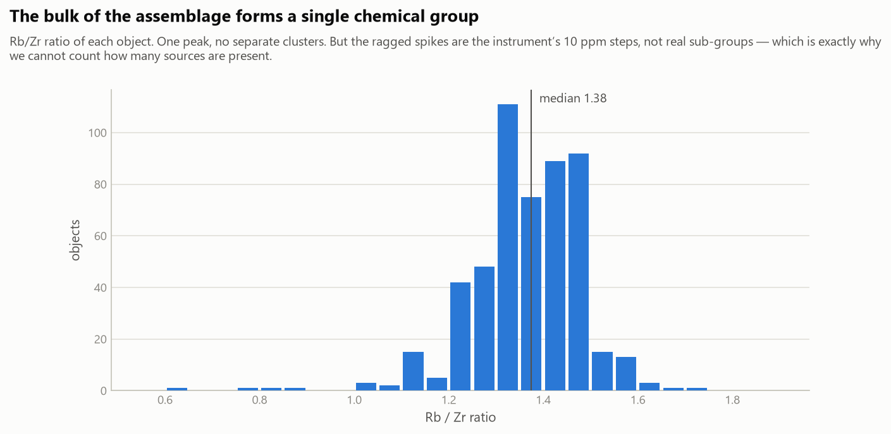
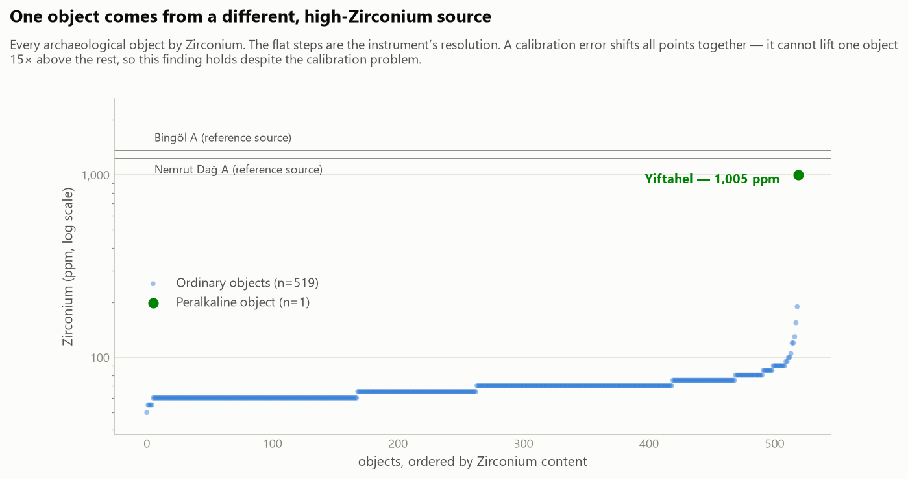
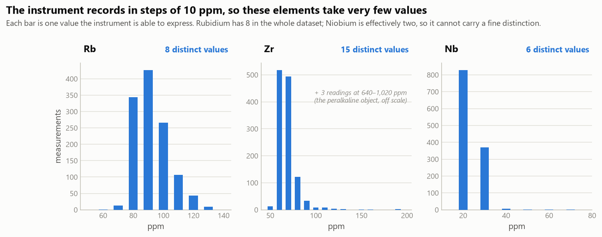
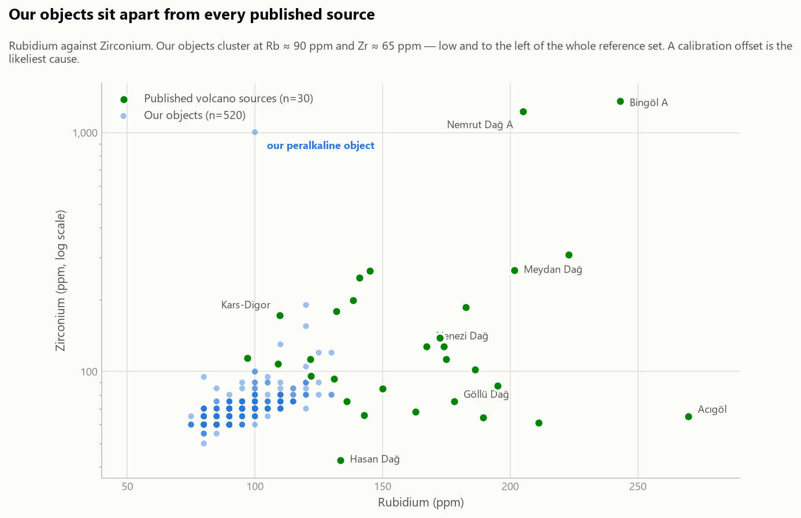

# Obsidian Provenance Project — Data Preparation Report

**Prepared for supervisory review — 21 July 2026**

Sites: Motza, Einan/Ain Mallaha, Yiftahel (Israel)
Method: portable X-ray fluorescence (pXRF)
Data: 1,228 measurements taken 2017–2018

---

## Summary for the reader in a hurry

We prepared the excavation obsidian measurements for source analysis. The data
is now clean, traceable and ready.

**One positive result:** one excavated object from Yiftahel comes from a
**different, peralkaline source** (eastern Anatolia — Bingöl A or Nemrut Dağ).
Its Zirconium is 15 times that of the rest of the assemblage. This conclusion is
**independent of the calibration problem below**, because a calibration error
cannot produce a fifteen-fold difference. It is evidence of more than one supply
route reaching Yiftahel.

**Two limitations must be understood before any further conclusion is drawn:**

1. **The measurements are very coarse.** The instrument recorded in percent with
   three decimals, so its smallest step is 10 ppm. Rubidium therefore takes only
   **9 different values** in the entire dataset, and Niobium only **6**.
2. **Our numbers sit below the entire published range.** Our samples read
   Rb ≈ 90 ppm; every Anatolian volcano in the reference literature is 110 ppm or
   more, most 130–270. No certified standard was ever measured, so we cannot
   correct for this.

**Consequence:** we can describe and group the assemblage, and we can identify a
*grossly* different source when one is present (as above) — but we **cannot name
the volcano** for the main body of material. The fix is cheap: one measurement
session using a standard reference glass (RGM-2) on the same instrument. See
Section 8.

---

## 1. What the project is trying to do

Obsidian is natural volcanic glass. It does not occur in Israel, so every
obsidian tool found here was carried from elsewhere — mostly from volcanoes in
Anatolia (modern Turkey). Each volcano has its own chemical "fingerprint": the
proportions of trace elements such as Rubidium (Rb), Zirconium (Zr) and Niobium
(Nb) in the glass.

If we measure the chemistry of a tool and compare it with the fingerprints of
known volcanoes, we can say where the raw material came from. That tells us about
long-distance contact and exchange in the Neolithic and Natufian periods.

**Our task in this stage** was not to answer that question, but to prepare the
measurements so that the answer, when we give it, is trustworthy.

---

## 2. Why the data needed careful preparation

The measurements were made in 2017–2018 over many sessions and later gathered by
hand into one large workbook. Before using it we checked it thoroughly. What we
found:

- The same instrument was also used for **other research projects** — Roman
  bronze from Caesarea, pottery from Tel Tsaf, metal objects. Those readings sit
  in the same files and had to be separated out.
- The instrument's **reading numbers repeat**. Its counter was reset between 2017
  and 2018, so 94 numbers appear twice. Reading 1682, for example, is both a
  Yiftahel tool and a Motza tool. Using the reading number alone as an identifier
  would merge tools from different sites.
- One object had been **lost through a spelling mistake** — its label read
  "obidian" instead of "obsidian", so it was missed when the workbook was
  assembled.
- Most tools were **measured twice**, once on each face.

None of this is unusual for field data. But each point changes the result if it
is not handled deliberately.

---

## 3. What "cleaning" means here, step by step

Our guiding rule: **nothing is deleted silently.** Every original measurement is
still in the output file, marked either *kept* or *removed*, and every removal
carries its reason. Anyone can check our decisions. The original files were never
modified.

### Step 1 — Identify each measurement correctly

We identify a measurement by **reading number together with its timestamp**,
never the number alone. This prevents the 2017/2018 duplicates from merging.

### Step 2 — Read the researcher's own notes first

The researcher marked bad measurements directly in the spreadsheet cells — for
example writing "Invalid" where the time should be, or "aborted" in the location
field. Standard software turns such text into an empty cell, which makes the
warning disappear. We therefore read the raw text **before** any processing, and
treat these notes as decisions by the person who was present at the measurement.
Their judgement outranks any rule we could invent.

### Step 3 — Handle "below detection limit" correctly

When an element is present in too small a quantity, the instrument reports
`< LOD` ("below limit of detection") instead of a number. **We treat these as
missing, never as zero.** Recording them as zero would be chemically false and
would pull the averages down, making samples look poorer in that element than
they are.

### Step 4 — Remove measurements that cannot be used

Three rules. They removed **19 of 1,228** measurements (1.5%):

| Rule | Removed | Reason |
|---|---:|---|
| The researcher marked it bad | 1 | His note at the time of measurement |
| Rb, Zr or Nb was not measured | 17 | Without these there is nothing to compare |
| The run was clearly aborted (< 60 seconds) | 1 | Incomplete measurement |

**The second rule is the important one, and it replaced an earlier idea of ours.**
We had first assumed that a measurement lasting the normal ~120 seconds was
sound. One case proved that wrong: a measurement ran 102.8 seconds — nearly full
length — yet Rb, Zr **and** Nb were all below the detection limit, and its Iron
was three times the normal value. It looked fine by duration and was useless in
fact. **The correct test is whether the elements we need were actually measured,
not how long the instrument ran.**

### Step 5 — Combine the two faces into one object

Most tools were measured on both faces (dorsal and ventral). These are **not two
independent samples** — they are one object measured twice.

We group measurements that share **site + locus + basket**, which the excavator
confirms identifies a single object. Site is part of the key, so measurements
from different sites can never be combined.

**Result: 1,209 measurements represent 521 objects.**

This matters statistically. Treating 1,209 measurements as independent would
overstate our sample size by more than double and make our confidence intervals
appear roughly **1.4 times narrower** than they truly are — a false impression of
precision. All results below count **objects**.

### Step 6 — Score the quality of every object

Each object receives a score from 0 to 1, combining six things we actually
recorded (Section 6). Low-quality objects are **not deleted** — they are carried
forward with wider uncertainty. This keeps the decision visible instead of hidden.

---

## 4. The mathematics and statistics we use — and why

This section explains every calculation in the analysis in plain terms.

### The median (not the average)

The **median** is the middle value when numbers are placed in order. The
**average (mean)** adds everything and divides by the count.

We use the **median** to combine the measurements of one object.

*Why:* the average is easily distorted by a single wrong value. If one face of a
tool gives a bad reading, the average moves towards it and the final number
describes neither face. The median simply takes the middle and ignores how
extreme the outlier is.

> **Important limitation, stated honestly:** when an object has exactly **two**
> measurements, the median and the average are the same number. So for the 392
> two-measurement objects, the median gives no protection at all. Those objects
> depend entirely on the disagreement rule described next.

### Percentiles

The **95th percentile** is the value below which 95% of the data falls. We use
percentiles instead of minimum and maximum because a single extreme value can
make the true range look far wider than it is.

### Standard deviation (sd)

A measure of **spread** — how far values typically sit from their centre. A small
sd means the values cluster tightly; a large sd means they are scattered.

### Ratios instead of raw amounts

Rather than comparing raw concentrations, we mainly compare the **ratio Rb ÷ Zr**.

*Why:* raw amounts are affected by how the instrument sits on the object — the
angle, the surface, how much of the beam actually strikes the sample. We
demonstrated this in the data: as the unmeasured fraction rises, the absolute
Rubidium value drops from 0.010% to 0.008%, but **the Rb/Zr ratio stays constant
at about 1.33 throughout**. Both elements are affected together, so dividing one
by the other cancels much of the distortion.

This is standard practice in obsidian provenance work, and our data supports it
independently.

### The "fold-difference" and why we do not average across disagreement

The **fold-difference** is how many times larger the biggest measurement is than
the smallest. Two readings of 0.008 and 0.1 differ by 12.5-fold.

We measured how much the two faces of one object **normally** disagree, across
392 two-measurement objects:

| Element | median disagreement | worst case observed |
|---|---:|---:|
| Rb | 0% | 1.38× |
| Zr | 0% | 1.57× |
| Nb | 0% | 1.50× |

The two faces of a tool normally agree almost perfectly. This is expected:
obsidian is **glass**, chemically uniform by its nature — which is precisely why
provenance study is possible at all.

**Our threshold is therefore 1.6×**, taken from the data rather than chosen
arbitrarily. Beyond that, the readings are treated as disagreeing.

**When they disagree we do not average them.** Averaging 0.008 and 0.1 produces
0.054 — a value describing neither measurement and matching no real material. It
would then be compared against the volcano fingerprints and could yield a
confident but entirely wrong answer.

Instead we ask which reading is implausible **on independent grounds** — is it
outside the range of everything else we measured? If yes, that reading is
removed. If both readings are individually plausible and still disagree, we
**flag the object for human inspection and produce no value**, because the
disagreement may mean the basket contains two different pieces rather than one.

*This distinction matters:* "it disagrees with its partner" is not a valid reason
to delete a measurement — that would assume the conclusion. "It lies outside the
plausible range of the entire assemblage" is a valid reason.

### The quality score

A weighted average of six components, each between 0 and 1:

| Component | Weight | Meaning |
|---|---:|---|
| Agreement between measurements | 35% | Does the object agree with itself? The strongest evidence we have |
| Surface coverage | 25% | How much of the beam struck the sample |
| Dirt recorded | 15% | pXRF reads the surface, so dirt biases it |
| `Bal` within normal range | 15% | See below |
| Number of measurements | 10% | More measurements, more confidence |

Where information is missing, we score it **0.5 = unknown** — never "good". An
unrecorded dirt field does not mean the object was clean.

### `Bal` — what it means

`Bal` ("balance") is the share of the sample the instrument **could not
identify**. We verified this: all measured elements plus `Bal` sum to exactly
100% (median 99.993%).

For obsidian, that unidentified share is mostly **oxygen**. Volcanic glass is
about 46% oxygen by mass, and pXRF cannot detect oxygen at all. A `Bal` of 55–65%
is therefore completely normal — not an error.

> *We initially believed `Bal` indicated how well the beam covered the sample.
> We tested this against the recorded coverage field and it was not supported
> (full coverage 57.9, "tiny" coverage 50.7 — no consistent pattern). We
> corrected this and now use `Bal` only as a signal that a reading is unusual.*

---

## 5. Results of the cleaning

| | Count |
|---|---:|
| Measurements examined | 1,228 |
| Removed (with reason recorded) | 19 |
| Measurements used | 1,209 |
| **Objects for analysis** | **521** |
| Objects flagged for inspection | 2 |

**Quality distribution:** 367 high, 135 medium, 19 low. Mean score 0.78.

### Chemistry by site — the central result so far

| Site | Objects | Rb (ppm) | Zr (ppm) | **Rb/Zr** | sd |
|---|---:|---:|---:|---:|---:|
| Motza | 388 | 90 | 65 | **1.375** | 0.118 |
| Einan | 105 | 100 | 70 | **1.357** | 0.124 |
| Yiftahel | 28 | 88 | 60 | **1.393** | 0.351 |

**The bulk of the assemblage is chemically uniform.** The three sites' Rb/Zr
ratios differ by less than 3%, while the spread within each site is around 9%.

**How this should be interpreted.** It is consistent with all three sites drawing
the majority of their obsidian from one source. But the spread (sd ≈ 0.12) is
approximately **one step of the instrument's resolution**, so the apparent
variation may be rounding alone. The honest formulation is:

> *For the great majority of objects we find no evidence of more than one source,
> and we do not have the resolution to rule one out.*

Note the sample imbalance: Motza contributes 388 objects, Yiftahel only 28.

### A second source IS present — two objects at Yiftahel

Yiftahel's larger spread (sd 0.351) is not noise. It is caused by **one excavated
object whose chemistry is categorically different from the other 519**:

| | Rb | Zr | Nb | Fe | Zr/Nb |
|---|---:|---:|---:|---:|---:|
| Our 519 ordinary objects (median) | 90 | **65** | 20 | ~0.7% | 3.0 |
| **Yiftahel, locus 1233 / basket 10671** | 100 | **1005** | 65 | 2.3% | 15.5 |
| *(modern comparative specimen, not excavated)* | 70 | *640* | 50 | 2.0% | 12.8 |

**Zirconium is 15 times higher.** Niobium and Iron are elevated in step. That
combination — high Zr, high Nb, high Fe — is the signature of **peralkaline**
obsidian, which in this region means the eastern Anatolian sources **Bingöl A**
or **Nemrut Dağ**:

| Reference source | Rb | Zr | Nb | Zr/Nb |
|---|---:|---:|---:|---:|
| Bingöl A | 243 | 1354 | 60 | 22.4 |
| Nemrut Dağ A | 205 | 1229 | 65 | 18.9 |
| (Göllü Dağ, Nenezi, Acıgöl) | — | 60–140 | 15–20 | 3–8 |

**This finding does not depend on calibration.** A calibration offset scales
every measurement together; it cannot make one object read fifteen times higher
than its neighbours. The difference is real regardless of the offset problem
described in Section 7.

The stronger of the two objects was **measured twice, on both faces, and the two
measurements agree to within 3%** (Zr 990 and 1020 ppm). It is not an instrument
error.

**What we can and cannot say about it:**
- We *can* say: one excavated object from Yiftahel comes from a **different,
  peralkaline source** than the rest of the assemblage — almost certainly eastern
  Anatolian.
- We *cannot* say whether it is Bingöl A or Nemrut Dağ. The two are chemically
  similar, and our uncertainty cannot separate them.

This also matters methodologically: it demonstrates that **our data can detect a
genuinely different source when one is present.** The instrument is not
uninformative — it is unable to make *fine* distinctions, not *gross* ones.

*A second high-Zirconium measurement (reading 1703, locus recorded as "Modern")
is a **modern obsidian comparative specimen** the researcher measured alongside
the assemblage, not an excavated artefact. It is excluded from all counts and
figures in this report, which use **520 archaeological objects**. Its
independently similar peralkaline chemistry is consistent, but it carries no
archaeological weight.*

With the peralkaline object removed, Yiftahel's spread falls from sd 0.351 to
**0.113** — in line with Motza (0.118) and Einan (0.124), confirming that this
object, not random noise, caused the difference.

---

## 6. First serious limitation — the measurements are very coarse

The instrument recorded concentrations in **percent with three decimal places**.
The smallest step it can express is 0.001% = **10 ppm**. For trace elements
present at 20–90 ppm, that step is enormous.

| Element | Distinct values in the 1,209 usable measurements | Typical value | One step equals |
|---|---:|---:|---:|
| Rb | **8** | 90 ppm | **11%** of the value |
| Zr | **15** | 70 ppm | **14%** |
| Nb | **6** | 20 ppm | **50%** |

Rubidium takes only the values 60, 70, 80, 90, 100, 110, 120 and 130 ppm in the
entire dataset. Niobium is effectively binary — 829 measurements read 20 ppm and
372 read 30 ppm.

**This cannot be repaired.** We checked every original instrument export: the
same resolution appears throughout, so nothing was lost in transcription. The
instrument's own error columns confirm it — they contain only 0.001 or 0.002,
meaning **the stated uncertainty is the same size as the rounding step**.

In practical terms:
- Rb = 90 ± 10–20 ppm → **±11–22%**
- Zr = 70 ± 10–20 ppm → **±14–29%**
- Nb = 20 ± 10–20 ppm → **±50–100%**

**Consequences:** Niobium cannot support a fine distinction and is demoted to a
rough check only. Rb and Zr carry real but blunt information. We can separate
volcanoes whose chemistry differs substantially; we cannot resolve volcanoes that
are chemically similar. For many objects the honest answer will be
**"undetermined"** — and reporting that is the correct scientific outcome, not a
failure.

---

## 7. Second and more serious limitation — the calibration gap

We compared our measurements with the reference database of volcano fingerprints
(326 geological samples from published studies).

**Our samples read Rb ≈ 90 ppm. Every Anatolian source in the literature is
110 ppm or higher, and the main candidates are 155–270 ppm.**

| Source | Rb (ppm) | Zr (ppm) |
|---|---:|---:|
| **Our samples** | **90** | **70** |
| Kars-Digor (lowest published) | 110 | 172 |
| Nenezi Dağ | 155 | 137 |
| Göllü Dağ | 178 | 75 |
| Acıgöl | 270 | 65 |
| Bingöl A | 243 | 1354 |

Our values fall **below the entire published range**. The only two sources
overlapping ours are Melos Adamas and Giali — both **Aegean**, which for
Levantine Neolithic obsidian would be an extraordinary claim requiring
extraordinary evidence.

The figure shows the two-dimensional separation clearly: our objects occupy a
region of the Rb–Zr plane that no reference source occupies. (A few of our
objects reach Rb 130 and so overlap the *lowest* sources on Rubidium alone, but
none coincides with a source in both elements together.)

**The ordinary explanation is instrumental.** The measurements were taken using
the instrument's factory "Mining" calibration, which is designed for soils and
ores, not for rhyolitic glass. Reading 50–75% low on trace elements in such
circumstances is well documented.

We tested this hypothesis formally: if a single calibration offset explains the
discrepancy, then for the true source the correction factor for Rb must equal the
factor for Zr. Of 32 sources, **five** satisfy this (Acıgöl2, Nenezi Dağ,
Carpathian 2, Sarıkamış, Giali), implying the instrument reads roughly **50–75%
of true concentration**.

**But we cannot confirm it.** Confirmation requires a certified reference
material measured on the same instrument. We searched every original workbook for
any such measurement — RGM, NIST, SRM, standard, control. **There is none.** The
only non-sample readings are 14 instrument self-tests reported in
counts-per-second, which contain no concentrations.

### Do ratios solve the problem? Partly — but less than we hoped

A ratio survives a calibration error **only if both elements are affected by the
same factor.** That is not guaranteed: each element has its own calibration
curve, so the errors can differ.

We can test this in our own data. If a single factor applied to everything, then
the sources matching our Rb/Zr should also match our Rb/Nb. They do not:

| | Rb/Zr | Rb/Nb |
|---|---:|---:|
| **Ours** | **1.38** | **4.0** |
| Nenezi Dağ | 1.35 ✅ | 10.0 ❌ |
| Sarıkamış | 1.40 ✅ | 10.4 ❌ |
| Acıgöl2 | 1.24 ✅ | 9.7 ❌ |

Our Rb/Nb is roughly **2.5 times off** from every source that matches on Rb/Zr.
The reason is Section 6: our Niobium sits at the instrument's detection floor
(20 ppm, only 6 distinct values), so it is not measuring real variation. **Any
ratio involving Nb is therefore unusable**, which removes the independent check
that would otherwise narrow the candidates.

Rb and Zr are adjacent elements with similar X-ray energies, so their calibration
errors are more likely to be similar, and Rb/Zr is the most trustworthy quantity
we have. But it is **not proven** safe, and it does not identify a unique source
in any case — see below.

### Which sources match our Rb/Zr?

Six of the 32 sources match within 15%:

| Source | Region | Method | Rb/Zr | Difference |
|---|---|---|---:|---:|
| Carpathian 2 | Europe | pXRF | 1.37 | 0.4% |
| **Nenezi Dağ** | **Cappadocia** | multi | 1.35 | 1.9% |
| **Sarıkamış** | **NE Anatolia** | multi | 1.40 | 2.0% |
| Giali | Aegean | pXRF | 1.27 | 7.6% |
| **Acıgöl2** | **Cappadocia** | multi | 1.24 | 9.6% |
| **Göllü Dağ1** | **Cappadocia** | multi | 1.55 | 12.7% |

On archaeological grounds the European and Aegean sources are implausible for
this material, which leaves four Anatolian candidates — three of them Cappadocian
(Nenezi, Acıgöl, Göllü Dağ), the expected region for Levantine PPNB obsidian.
That is a meaningful narrowing, but it is **not an identification**.

⚠️ **A further caution about the reference data itself.** Nenezi Dağ appears in
two studies with Rb/Zr of **1.35** and **1.13** — a 19% disagreement for the same
volcano, comparable to our own uncertainty. And "Göllü Dağ" is not one value: its
sub-sources range from **1.55 to 3.46**. The published fingerprints carry
between-laboratory variation of the same order as the effect we are trying to
measure.

---

## 8. What we propose to do next

### Immediate priority — measure a reference standard

**Measure RGM-2 on the same pXRF instrument, with the same settings.**

RGM-2 is a rhyolite glass reference material distributed by the United States
Geological Survey. It is obsidian, matrix-matched to our samples, and is the
standard used throughout this literature. A single short session would give the
correction factor for Rb, Zr and Nb, and would place our measurements on the same
scale as the published fingerprints.

**This is the single highest-value action available to the project.** It is
inexpensive and would probably resolve the entire difficulty.

*If the instrument is no longer accessible:* measuring several obsidian pieces of
independently known source would serve the same purpose. *If neither is possible:*
a small subset analysed by ICP-MS or NAA would anchor the dataset, at greater
cost.

### A second question requiring a decision

Our methodological rule is to compare like with like — portable instrument
against portable instrument — because mixing instrument types was the flaw in the
project's earlier analysis. However, of the reference database:

| Method | Measurements | Sources |
|---|---:|---:|
| pXRF (portable) | 52 | 8 |
| Multiple methods | 230 | 17 |
| EDXRF (laboratory) | 44 | 11 |

Only one study (Milic 2014) used a portable instrument, and its Anatolian
coverage is limited to **Göllü Dağ and Nenezi Dağ**. A strict like-for-like
comparison therefore has very few relevant sources. We must decide whether to
relax the rule and state the added uncertainty, or to seek further portable-
instrument reference data.

### What can be reported now, without further measurement

The following is defensible on the present data:

> *The obsidian assemblages from Motza, Einan and Yiftahel are chemically
> homogeneous at the resolution available, with the great majority of objects
> consistent with a single raw-material source, which cannot be identified from
> these measurements because the instrument was not calibrated against a
> reference standard. One object from Yiftahel is an exception: its strongly
> elevated Zirconium, Niobium and Iron identify a **peralkaline source**,
> pointing to eastern Anatolia (Bingöl A or Nemrut Dağ). This second-source
> identification does not depend on calibration, since the difference is an
> order of magnitude.*

That is a substantive archaeological result: evidence of **more than one supply
route** reaching Yiftahel.

The following is **not** currently defensible:

> ~~*The obsidian derives from Göllü Dağ.*~~
> ~~*The Yiftahel outlier derives from Bingöl A.*~~ (Bingöl A and Nemrut Dağ
> cannot be separated with our precision.)

We recommend against publishing any named-source attribution until the
calibration question is resolved.

---

## 9. Files produced

| File | Contents |
|---|---|
| `samples_db/obsidian_samples_CLEAN.xlsx` | The cleaned data, formatted for reading. Six sheets: README, Objects, Site_summary, Needs_review, Readings, Dropped |
| `samples_db/samples_objects.csv` | 521 objects — the analysis table |
| `samples_db/samples_readings.csv` | All 1,228 measurements with keep/remove decisions |
| `samples_db/cleaning_report.txt` | Full log of every step and every removal |
| `analysis/03_clean_samples.py` | The cleaning code, re-runnable from the raw files |
| `analysis/04_figures.py` | The code that produces the four figures |
| `results/figures/` | The four figures as PNG |

The Excel workbook is the one to open. Its **Objects** sheet is the analysis
table; **Needs_review** lists the two objects requiring inspection; **Dropped**
shows every removed measurement with its reason.

All original files in `data/` remain unmodified. Every number can be traced back
to its source file and original spreadsheet row.

---

## 10. Conclusions

### 10.1 What we can state with confidence

1. **The dataset is now clean, complete and traceable.** 1,228 measurements were
   examined, 19 removed with a recorded reason, and 1,209 retained, representing
   **520 archaeological objects**. Every number can be traced to its original
   file and spreadsheet row. The pipeline re-runs from the raw files and
   reproduces its output exactly.

2. **The assemblage is chemically homogeneous.** Motza, Einan and Yiftahel differ
   in Rb/Zr by less than 3%. The great majority of objects are consistent with a
   single raw-material source.

3. **At least two sources are present.** One excavated object from Yiftahel is
   peralkaline — Zirconium 15× the assemblage median, with Niobium and Iron
   elevated in step — indicating an eastern Anatolian source (Bingöl A or Nemrut
   Dağ). **This conclusion is unaffected by the calibration problem.**

4. **The instrument can detect gross differences.** Point 3 proves the data is
   not uninformative; it is imprecise, not blind.

### 10.2 The problems with the sampling — the full list

*These are the limitations that constrain what may be claimed. Points 1–4 are
properties of the measurements themselves and cannot be repaired by analysis.*

**1. The measurements are systematically low (calibration offset).**
Our samples read Rb ≈ 90 ppm against a published Anatolian minimum of 110 ppm and
a typical range of 130–270. The likely cause is that the instrument's factory
"Mining" calibration — designed for soils and ores — was applied to volcanic
glass. Testing implies the instrument reads **50–75% of true concentration**.
*Consequence:* absolute values cannot be compared with published data at all.

**2. No calibration standard was ever measured.**
No certified reference material (RGM-2, NIST, or similar) was run on this
instrument. We searched every original workbook. Without it, the offset in
point 1 **cannot be quantified or corrected**. This is the single decisive gap.

**3. The resolution is too coarse.**
Recording in percent to three decimals gives a smallest step of 10 ppm. Rubidium
therefore takes **8 distinct values** across the whole dataset, Zirconium 15.
Real uncertainty is Rb ±11–22%, Zr ±14–29%.
*Consequence:* chemically similar volcanoes cannot be separated.

**4. Niobium is at the detection floor and carries no information.**
⚠️ *A clarification: Nb is not "undetected" — it is reported in 99% of
measurements. The problem is subtler and worse.* It sits so close to the
detection limit that it takes only **6 values**, with 829 of 1,209 measurements
reading exactly 20 ppm and 372 reading 30 ppm. Its stated uncertainty (±10–20
ppm) is **as large as the value itself (±50–100%)**.
*Consequence:* Nb cannot support any fine distinction, and **every ratio
involving Nb is unusable** — which removes the independent cross-check that would
otherwise narrow the candidate sources. Our Rb/Nb is 4.0 where every source
matching our Rb/Zr sits near 10.

**5. Ratios only partly rescue the situation.**
A ratio cancels a calibration error **only if both elements are affected by the
same factor**. Point 4 is direct evidence that ours are not. Rb/Zr is the most
trustworthy quantity available and is probably sound — Rb and Zr are adjacent
elements with similar X-ray energies — but this is **reasoned, not demonstrated**.

**6. The reference literature is itself imprecise.**
Nenezi Dağ is published at Rb/Zr **1.35** in one study and **1.13** in another —
a 19% disagreement for the same volcano. "Göllü Dağ" spans **1.55–3.46** across
its sub-sources. Between-laboratory variation in the published fingerprints is of
the same order as the effect being measured.

**7. Only one reference study used a portable instrument.**
Our methodological rule is to compare like with like. Of the reference database,
only Milic 2014 is pXRF, and it covers just Göllü Dağ and Nenezi Dağ among
Anatolian sources.

**8. The sample is very unbalanced.**
Motza 388 objects, Einan 105, Yiftahel 28. Statements about Yiftahel rest on a
small sample.

**9. Surface condition was variable.**
Only 282 of 1,209 measurements had full beam coverage; dirt was recorded on 278.
Where the field was left blank we treat it as *unknown*, never as clean.

### 10.3 Why we cannot say how many sources are present

This deserves stating precisely, because it is the question most likely to be
asked.

Counting sources means asking whether the objects form **separate chemical
clusters**. Our data cannot answer that, for three compounding reasons:

- **Different sources can collapse into one measured value.** Rb/Zr is built from
  two elements each recorded in 10 ppm steps. Two genuinely distinct sources
  whose true Rb/Zr differ by less than roughly 0.12 would produce *identical*
  measurements. They would be invisible to us — not absent, invisible.
- **The steps can also create clusters that are not real.** The spikes in the
  histogram (Figure 3) are artefacts of the instrument's discrete steps, not
  sub-groups in the material. Reading them as clusters would be a mistake in the
  opposite direction.
- **The reference data cannot arbitrate.** Even a genuine sub-group could not be
  matched to a named volcano, because of the calibration gap and the spread in
  the published values (points 1, 2 and 6).

So the honest position is:

> We observe **one dominant chemical group** and **one clear exception**. We
> cannot determine whether the dominant group represents one source or several
> chemically similar ones. Our data can establish a **lower bound of two
> sources**, and cannot establish an upper bound at all.

Any statement of the form "the assemblage derives from N sources" would be
unsupported for any N.

### 10.4 Assessment

The data preparation is complete and sound. The assemblage is well characterised
and internally consistent, and it has already yielded one substantive
archaeological result — evidence of a second, eastern Anatolian supply route
reaching Yiftahel.

The obstacle to full source attribution is not the quality of the excavation data
or of the preparation. It is a missing calibration measurement, which was not
taken at the time and could not reasonably have been anticipated. It is
straightforward and inexpensive to remedy (Section 8).

We consider it preferable to identify this now than to discover it after
publishing attributions that could not be supported. The earlier analysis of this
material, which we set aside, made precisely that error: confident assignments
resting on differences smaller than the instrument could measure.
